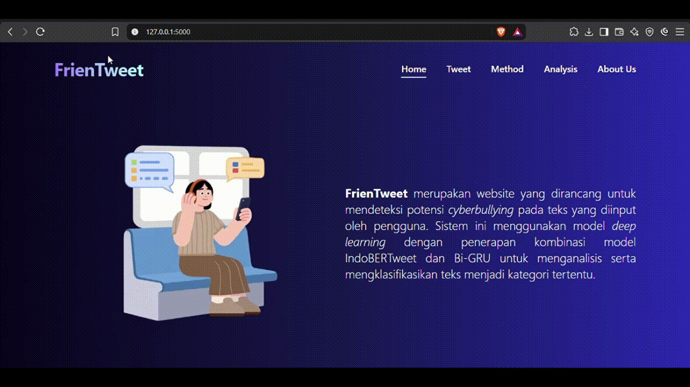

# FrienTweet

FrienTweet is a web-based application for detecting Indonesian cyberbullying content using a hybrid IndoBERTweet-BiGRU model.

The application allows users to enter a text and receive a predicted cyberbullying category through an intuitive web interface. FrienTweet was developed as an implementation of an Indonesian cyberbullying detection model, bridging the gap between machine learning experimentation and a user-facing application.

## Features
- Detect cyberbullying from Indonesian text
- Classify text into five categories
- Display the predicted category 
- Perform text preprocessing before prediction
- Store prediction records using SQLite
- Provide an interactive web-based interface

## Tech Stack

**Machine Learning Model:** IndoBERTweet-BiGRU

**Front-end:** HTML, Tailwind CSS

**Back-end:** Flask

**Database:** SQLite


## Demo



## Installation
Do these following steps on your Command Prompt
### 1. Clone the repository
```bash
  git clone https://github.com/fajriauluminn/FrienTweet.git
  cd FrienTweet
```
### 2. Create a virtual environment
```bash
  python -m venv venv
```
Activate the virtual environment (Windows):
```bash
  venv\Scripts\activate
```
### 3. Install Dependencies
```bash
  pip install requirements.txt
```

### 4. Run Application
```bash
  python app.py
```
Open the local URL shown in the terminal in your browser.

## Machine Learning Behind This Project

This application is based on an undergraduate thesis project focusing on Indonesian cyberbullying detection using a hybrid IndoBERTweet-BiGRU model.

The research repository contains the machine learning pipeline, including data preparation, preprocessing, labeling, training, and evaluation. You can read more about it [here](https://github.com/fajriauluminn/IndoCyberbullyingDetection)!
The trained model is hosted on Hugging Face and can be accessed [here](https://huggingface.co/fajriauluminn/indotweetcyberbullying)

